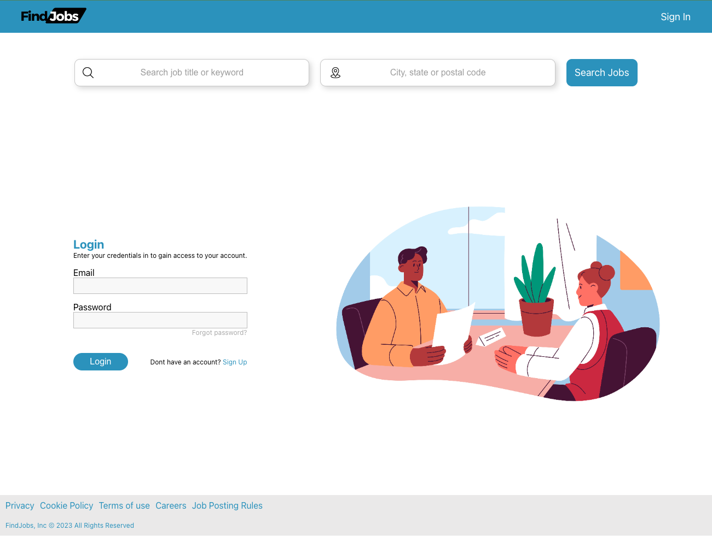
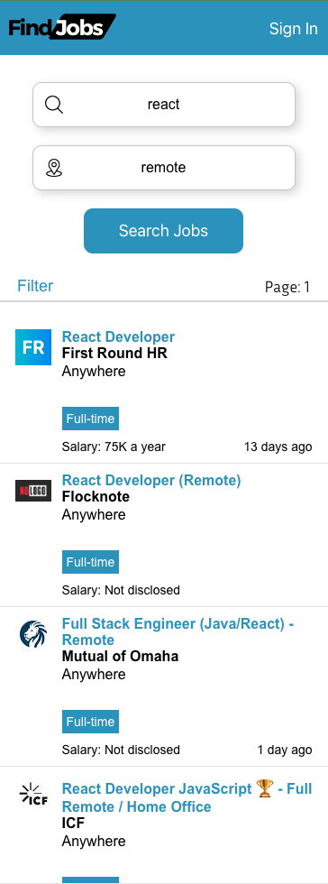
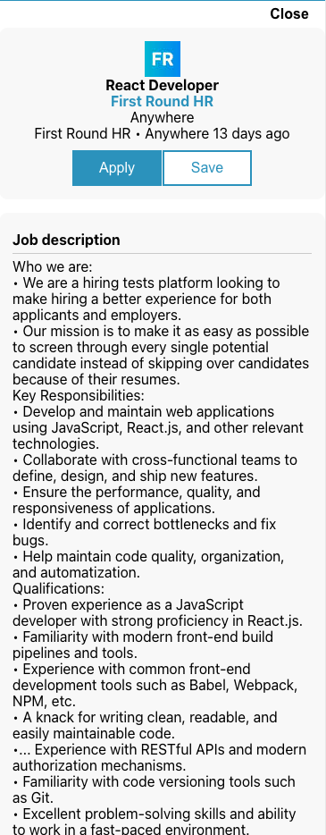
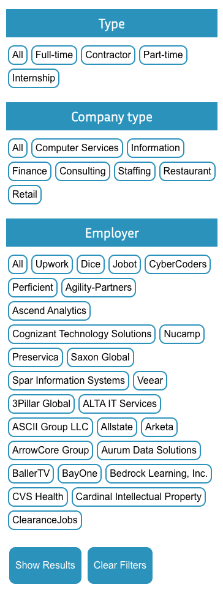
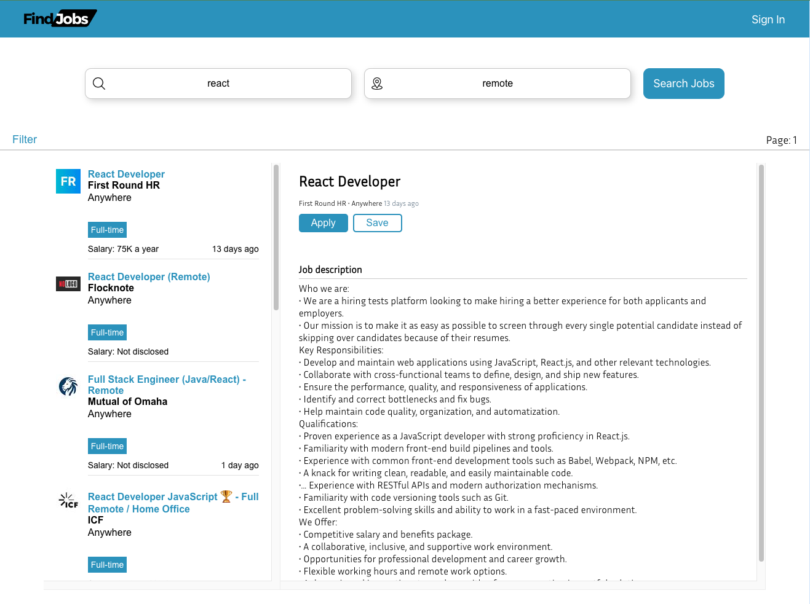

# FindJobs

The main objective of this application is to empower users to search for employment opportunities and submit job applications. The app incorporates filtering features to refine search results for a more customized experience, along with the capability to apply to jobs across all platforms where they are posted. This is a full-stack project developed using React, Express, and SerpApi's Google Jobs and Google Listings API(https://serpapi.com/google-jobs-api).

### `Home`

 
 

### `Search`

